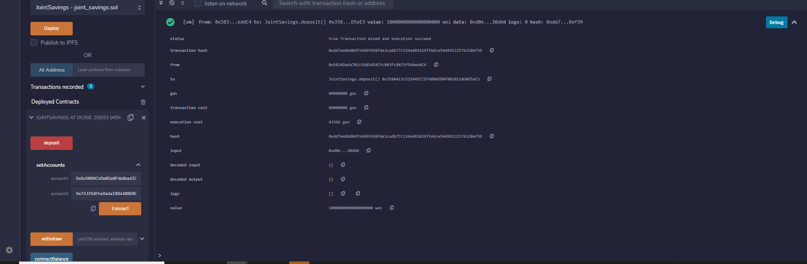
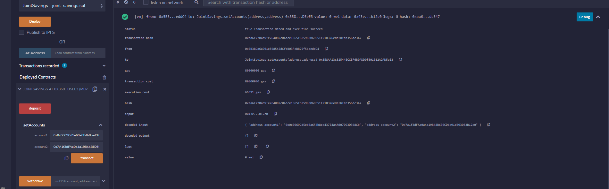
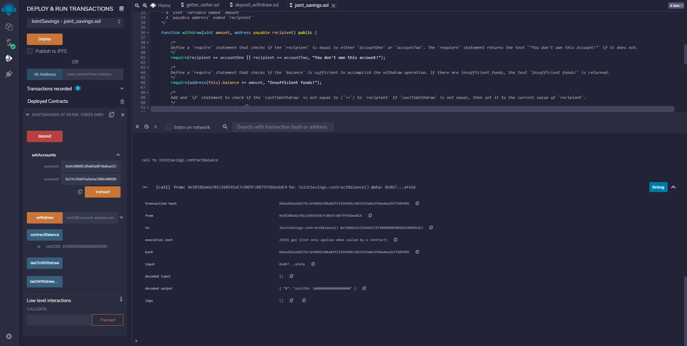
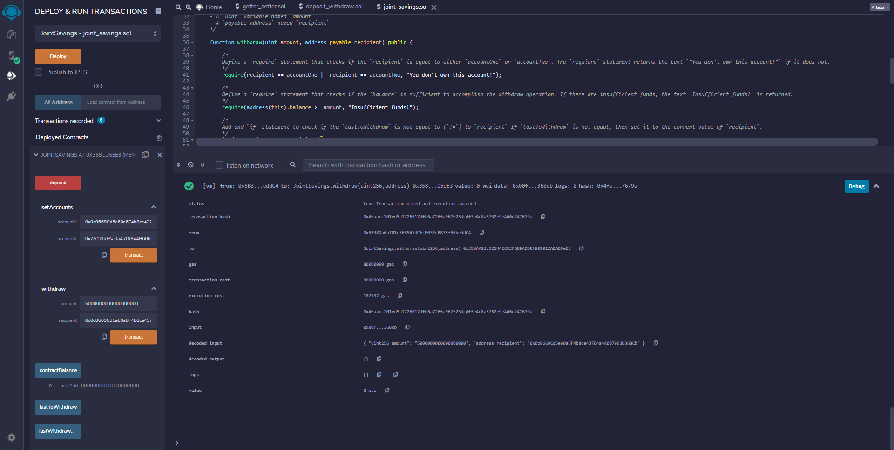

# Solidity_JointSavingsAccount
## Overview
Creating a joint savings account smart contract using solidity. The contract begins by defining 5 variables (accountOne, accountTwo, lastToWithdraw, lastWithdrawlAmount, and contractBalance). Then, functions are created to set the accounts, deposit, withdraw, and a default fallback function to store ether sent from outside the deposit function. 
## Usage

Screenshots demonstrating the usage of this contract are attached below.

The contract once it has been deployed using the JavaScript VM:

Setting accounts:

The contract deposit functionality:

The contract deposit functionality:

The contract deposit functionality:

Confirming test withdraw:

Confirming test withdraw:

---

## Contributors

Brought to you by Carlos R. you may reach me at reachcarlostoday@gmail.com

---

## License

MIT.